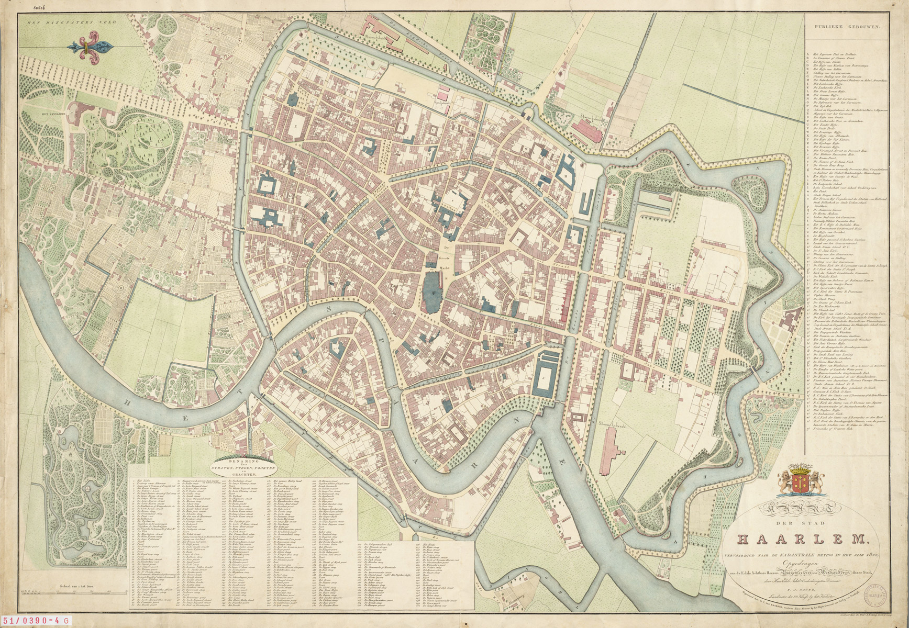

#The Nautz Haarlem Map
Data from the 1829 map of Haarlem bij F.J. Nautz

##The Map

The map, published in 1829, was based on measurements bij F.J. Nautz in 1822. This version of the map (with steam- and gasworks added much later in the 19th century!) is from the [Noord-Hollands Archief](http://noord-hollandsarchief.nl/beelden/beeldbank/detail/3f2a45da-fb8f-11df-9e4d-523bc2e286e2). A high-resolution download is offered by [geschiedenislokaal 023](http://www.geschiedenislokaal023.nl/bronnen/stad-in-verval-1829/).

What makes the map 'The First Tourist Map' of Haarlem are the two lists on the bottom, with 300 streetnames, and the right, with a 100 names of public buildings.

I digitised and standardised these names, georeferenced the map and digitised the geometries of streets and buildings that have since dissapeared or changed significantly. You'll find the result of these efforts in this repository.

##The Data

The [__GeoJSON file__](nautz.geojson) contains the geometries of streets and buildings that no longer exist or changed significantly in their appearance - sometimes names are used for just part of the nowadays equivalent or vice versa, sometimes buildings still exist but have only remotely regocnizable geometries.

The __CSV file__ contains all names, with a geojson chunk if there is a geometry, and a [BAG](https://nl.wikipedia.org/wiki/Basisregistraties_Adressen_en_Gebouwen) id if the street or building still exists today.
